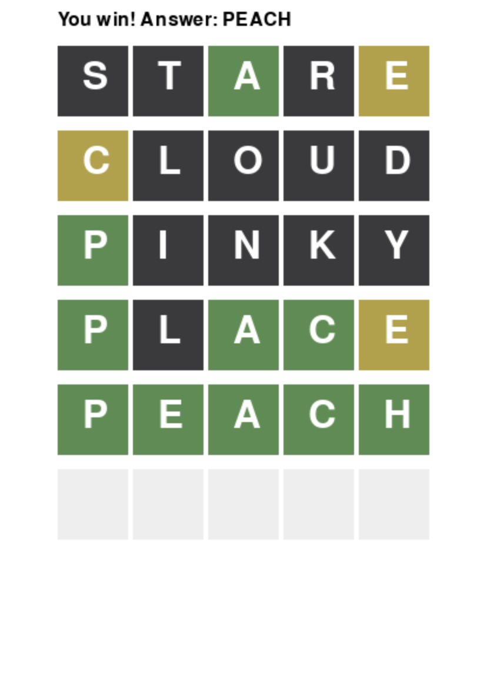

# Pygame Wordle
## CS110 A0/B1 Final Project  Fall, 2025

## Team Members

Tristan Dinh, Andre Barnett, Ekramul Haque, Hasnaen Shaior

***
## Project Description

This project is a recreation of the famous Wordle game by The New York Times. The goal of the game is to guess a 5-letter word correctly given 6 attempts. Each attempt provides information for the correct word by assigning a letter a certain color based on its position and whether it is present in the correct word. The player wins by guessing the correct word, and loses if they run out of attempts without getting the word.

***

## GUI Design

The design of the game is simple. Each letter of a guess is placed in a row of squares within a 5x6 grid. The background color of a square is updated in correspondense to its validity. The word is revealed on the top if the player loses.

### Initial Design

### Final Design

## Program Design

### Features

1. Random Word Selection - chooses a five-letter word from a JSON word bank.
2. Player Input Handling - supports typing letters, backspace, and submitting guesses.
3. Feedback Coloring - displays green, yellow, or gray feedback for each guess.
4. Win/Loss Conditions - Win if the word is guessed within six tries, lose otherwise.
5. Endgame Message - displays "You win!" or "Game over" with the correct word.

### Classes

- InputHandler (controller/input_handler.py)
    - Manages keyboard input, validates guesses, and communicates with the game state.

- GameState (model/gamestate.py)
    - Stores the target word, player guesses, and maximum attempts.
    - Provides feedback logic for guesses and checks win/loss conditions

- WordBank (model/wordbank.py)
    - Loads words from a JSON file and selects a random target word.

- GameGUI (view/gui.py)
    - Handles rendering of the game board, guesses, feedback colors, and messages.

## ATP

| Step                 |Procedure                   |Expected Results                                |
|----------------------|:--------------------------:|-----------------------------------------------:|
|  1                   | Run Wordle Program         | GUI window appears with empty 5x6 grid         |
|  2                   | Type letters               | Letters appear in the current row.             |
|  3                   | Press Enter with 5 letters | Guess submitted; feedback colors applied       |
|  4                   | Submit multiple guesses.   | Row fills with feedback until attempts run out |
|  5                   | Guess correct word         | "You win! Answer: " message appears            |
|  6                   | Fail after 6 guesses       | "Game over. Answer: " message appears          |
|  7                   | Close window               | Program exits safely.                          |